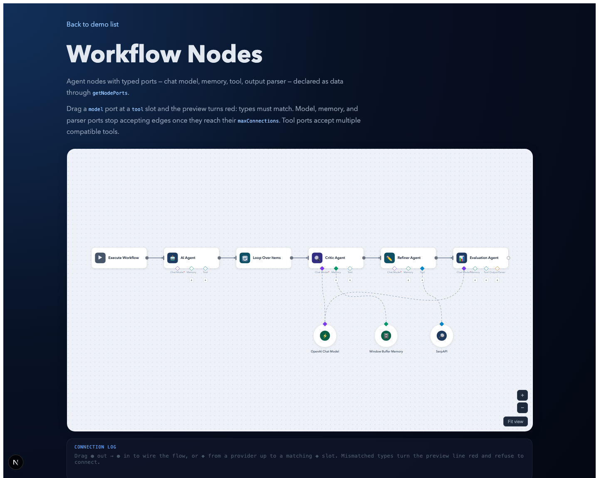
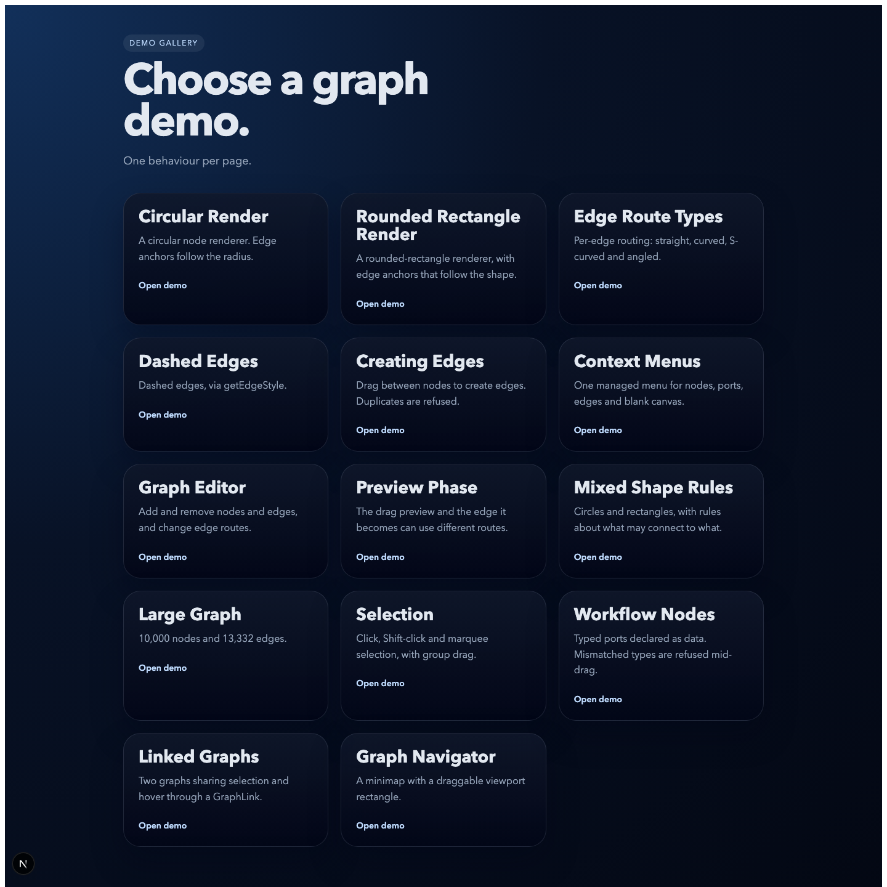

# GraphSpike

[](https://github.com/AmerjitSingh/GraphSpike/actions/workflows/ci.yml)

**graph-canvas** — a React component for node-edge graphs that stays fast at
scale. Nodes and edges are painted onto canvas, so a 10,000-node graph pans and
zooms smoothly; the node you interact with is swapped for real DOM, so it can
hold ordinary React content — inputs, popovers, portals.

[](#demos)

```tsx
import { GraphCanvas } from "@graphspike/graph-canvas";

const nodes = [
  { id: "1", data: { label: "React" } },
  { id: "2", data: { label: "Node.js" } },
];
const edges = [{ id: "e1", source: "1", target: "2", data: { label: "runs on" } }];

<div style={{ width: "100%", height: 600 }}>
  <GraphCanvas nodes={nodes} edges={edges} />
</div>;
```

## Highlights

- **Canvas rendering, DOM interaction** — everything is paint until you select
  it; hit-testing runs against an R-tree, not the DOM.
- **Force layout in a Web Worker** — d3-force positions new nodes off the main
  thread, and hands a node over the moment you drag it.
- **Typed ports** — declare connection endpoints as data (`input`/`output`,
  type matching, `maxConnections`); one validator governs pointer drags and
  keyboard connects alike.
- **Accessible** — the graph mirrors into semantic listboxes: arrow-key
  traversal, Enter/Space selection, keyboard connect with port cycling.
- **Batteries** — pan/zoom, marquee selection, group drag, snap-to-grid,
  context menus, edge toolbars, four edge routes, minimap, and cross-graph
  linking between multiple canvases.

Full API documentation lives in [graph-canvas/README.md](graph-canvas/README.md).

## Demos

```bash
npm install
npm run dev
```

Then open <http://localhost:3031> for the demo gallery — one behaviour per
page, from a two-node renderer up to 10,000 nodes and 13,332 edges.



## Repository layout

| Path | What it is |
|---|---|
| [`graph-canvas/`](graph-canvas) | The library, packaged as `@graphspike/graph-canvas` |
| [`app/`](app) | Next.js demo gallery exercising every feature |

## Development

```bash
npm run check
```

Runs the type check, lint (oxlint) and the test suite. `npm run test:coverage`
enforces coverage thresholds; `npm --prefix graph-canvas run build` compiles
the library to `graph-canvas/dist`.

## License

[Apache-2.0](graph-canvas/LICENSE)
